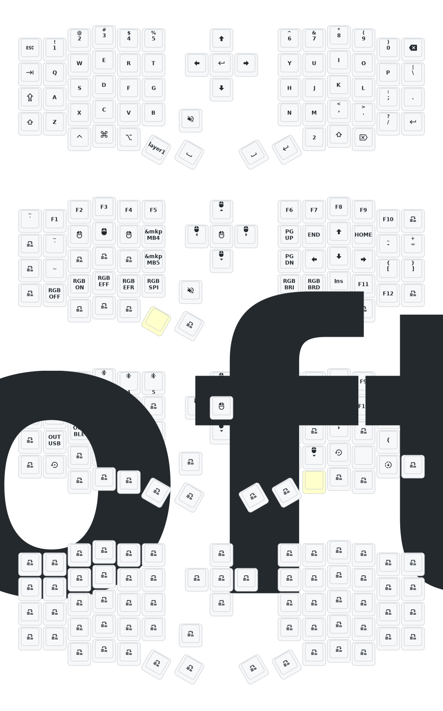

- [中文](README.md)
- [English](README_EN.md)

# 更新列表

- 2026/3/6
  1. 全部模型都有修改，绘制了2各版本的手托
  2. 修复了旋钮失效的问题
  3. 修改了防抖时间，如果用的轴体性能号可以缩减防抖时间。如果用的轴体品质一半，可以拉长防抖时间。
  
- 2024/12/21
  
- 2024/10/24
  1. 修改供电模式，功耗降低。
  2. 修正RGB供电自动关闭的功能。

> 如果您的键盘于10月24日之前更新，请更新最新的固件。
> 
---
# 联系我

如需3D打印的模型文件或者键盘有任何异常和故障，请联系380465425@qq.com

# Sofle键位图

